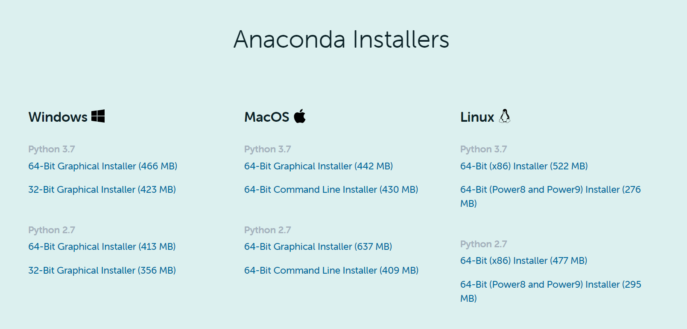
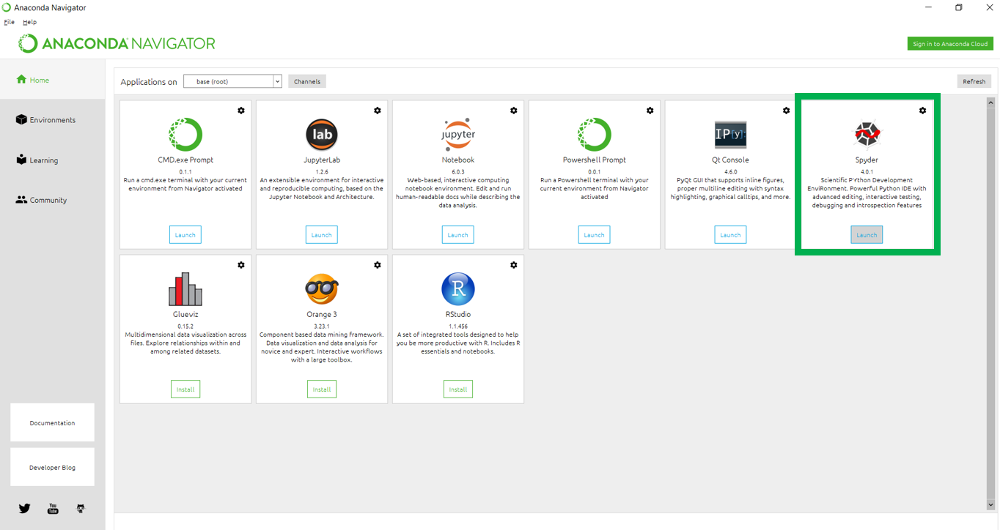
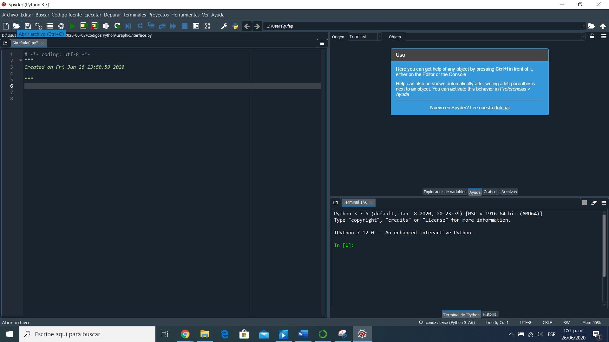

**UNIVERSIDAD DE LOS ANDES**\
**FACULTAD DE INGENIERÍA**\
**DEPARTAMENTO DE INGENIERÍA MECÁNICA**

------------------------------------------------------------------------

**Farmbot simulator: Manual de desarrollador**

Estudiantes:\
***Víctor Alexander Murcia Vargas***\
201416659\
***Juan Felipe Palacios Sanchez***\
201616389

Asesor\
**Giacomo Barbieri, PhD**

Introducción
============

El presente manual es un instructivo para la utilización y modificación
del Farmbot software implementado usando Spypder en anaconda. En primera
instancia se presentan las instrucciones de instalación del programa, el
uso del código, el diagrama de clases, la descripción de las mismas y
por ultimo las oportunidades de mejor

Instalacion del software requerido
==================================

Anaconda Navigator
------------------

En este proyecto se utilizo el software ANACONDA que cuenta con diversos
IDE para programación en diferentes lenguajes, uno de ellos es Spyder
para la programación en Python. Este programa se puede descargar
siguiendo los pasos a continuación: Ingresar a la página
www.anaconda.com

    

En la pestaña de Products se debe seleccionar la opción Individual
Edition:

    

Y en la última sección de la página, encuentra los instaladores para
cada sistema operativo:

    

Después de seleccionar el instalador de acuerdo con su dispositivo, debe
seguir los pasos de instalación de Anaconda y finalmente contara con la
aplicación. Esta es la interfaz de la aplicación de ANACONDA:

    

En esta nos importa la sexta aplicación de la primera fila, Spyder. Para
abrir Spyder basta con darle click en el botón "Launch" que se encuentra
debajo de la descripción de este.

    

Una vez abierto Spyder, puede abrir los archivos de los códigos
realizados en Python. Tenga en cuenta que es necesario que todos los
códigos estén en una misma carpeta.

ATENCIÓN: No es obligatorio el uso de ANACONDA, si ya cuenta con otra
aplicación de preferencia para el desarrollo de programación en Python,
puede usarla.

### Instalación de paquetes

Si bien la mayoria de paquetes ya vienen incluidos con la distribucion
de anaconda, se recomienda revisar que los siguientes paquetes ya se
encuentren instalados:

-   Tkinter

-   threading

-   serial

-   numpy

Si alguno de los siguientes paquetes no se encuentra instalado, o
requiere instalar algun adicional. Abra anaconda navigator, seleccione
enviroments, alli puede consultar e instalar los nuevos paquetes que
requiera.

{#fig:anaconda6 width="0.7\\linewidth"}

[\[fig:anaconda6\]]{#fig:anaconda6 label="fig:anaconda6"}

Otra forma de instalar paquetes es usando la sentencia \"pip install
\<nombre del paquete\>\" en la consola de anaconda.

Virtual Serial Ports Free
-------------------------

El instalador del programa se encuentra en la carpeta llamada \"Virtual
Serial\", para instalarlo ejecute el archivo como administrador del
sistema y siga los pasos. Si desea la ultima versión del programa la
puede descargar del siguiente
[link](https://freevirtualserialports.com/).El programa corriendo se
muestra en la figura.Para configurar los puertos seriales para esta
aplicacion realice los siguientes pasos

-   Abra el programa con permisos de administrador

-   Haga click en \"Continue with limited features\"

    {#fig:virtual1 width="0.\\linewidth"}
    [\[fig:virtual1\]]{#fig:virtual1 label="fig:virtual1"}

-   Haga click en \"Create Local Bridge\"

    {#fig:virtual2 width="0.5\\linewidth"}
    [\[fig:virtual2\]]{#fig:virtual2 label="fig:virtual2"}

-   Seleccione los nombres de los puertos, tenga en cuenta estos nombres
    para posteriormente usarlos en las aplicaciones.

    {#fig:virtual3 width="0.5\\linewidth"}

-   Presione click en Ok, tenga en cuenta que estos puertos existirán
    unicamente hasta que reinicie el sistema, es decir cada vez que lo
    reinicie deberá seguir los pasos anteriormente descritos.

Una vez instalado y creado el puerto serial, debera modificar el archivo
\"Codigos Python/GraphicInterface.py\" y cambiar el contenido de la
variable \"self.comPort\" cuya declaración se encuentra en la linea 51
del código, allí deberá cambiar el nombre por el nombre de puerto que
creo anteriormente.

Interfaz C++ {#subsec:C++}
------------

Una vez configurado el puerto serial, el ejecutable del código de C++ se
encuentra en la carpeta \"Ejecutable\" este archivo no requiere de la
instalación de ningún paquete adicional. Al ejecutarlo deberá ver una
ventana como la siguiente.

{#fig:interfazc width="0.7\\linewidth"}

[\[fig:interfazc\]]{#fig:interfazc label="fig:interfazc"}

Para empezar a ejecutar el simulador debera configurar el farmbot com
port con el puerto que creo previamente y que no usó en la cofiguracion
de python. Por ejemplo: Si en virtual serial port creo los puertos COM1
y COM2, despues en python asigno el puerto COM1, en la interfaz de C++
debera selecionar como \"FarmbotPort\" el puerto COM2 y como client port
el puerto \"COM1\".

Utilización de la interfaz
==========================

Una vez realizados los pasos anteriores, podra correr el codigo de
python presionando la tecla f5 en sypder o el boton de run en la misma o
en cualquier IDE que este usando. una vez corriendo el codigo se abrirá
una interfaz como la siguiente:

{#fig:python1 width="0.7\\linewidth"}
[\[fig:python1\]]{#fig:python1 label="fig:python1"}

Antes utilizar cualquier funcionalidad se recomienda tener previamente
la interfaz de C++ configurada como se explica en la sección
[2.3](#subsec:C++){reference-type="ref" reference="subsec:C++"}

Arquitectura de software
========================

Diagrama de clases
------------------

En la siguiente figura se muestra el diagrama de clases así como las
relaciones entre cada una de las mismas en la sección
[5](#sec:descripcion){reference-type="ref" reference="sec:descripcion"}
se detalla cada una de estas

{#fig:claseuml
width="1\\linewidth"}

scheduling
----------

En la siguiente figura se muestran los hilos que son iniciados dy
finalizados en el programa.

{#fig:hilosusuario
width="0.7\\linewidth"} [\[fig:hilosusuario\]]{#fig:hilosusuario
label="fig:hilosusuario"}

Descripción de las clases {#sec:descripcion}
=========================

Farmbot
-------

En esta clase se inicializan el puerto serial, las dimensiones de las
materas y los threads de riego de cada matera. Para el puerto serial se
definen las funciones de iniciar el puerto, cerrar el puerto, recibir
mensajes de forma continua, el tiempo de espera para ejecutar comandos y
finalizar la comunicación. Los demás comandos mandan mensajes por serial
al Farmbot para que él los interprete y haga el respectivo procedimiento
de acuerdo con el código G mandado. Entre estos códigos están los de
leer y escribir pines, el de regar las materas y el del movimiento del
Farmbot sea en manual o automático. Seguidamente, se tienen funciones
para actualizar valores necesarios para el funcionamiento de las
funciones mencionadas anteriormente. Estas son las de actualizar los
valores de los sensores de humedad, leer lo mensajes mandados por el
Farmbot por serial, leer la posición actual del Farmbot y por último,
leer el estado de los pines.

Graphic Interface
-----------------

En esta clase se configura, se organiza y se crea la interfaz grafica
del usuario. Primeramente, se establecen las dimensiones de la interfaz
y se crean los paneles que ésta tendrá. Ademas, se crean variables de
estado que funcionan como condicionales para cambiar de funcionamiento
en la interfaz. Ademas, se crean los threads de movimiento automático y
movimiento manual; y se inicializa la clase de Farmbot. Por último, en
esta clase se crean las funciones de cada botón y las transiciones de
los Leds.

### MovementFrame

En esta clase se crean los botones de movimiento para cada eje del
Farmbot. Se definen el tamaño y posición de las flechas, en este caso se
importan como imágenes, y se usan las mismas para cada eje de
movimiento. Seguidamente, se crean los títulos para que el usuario pueda
identificar que botón debe utilizar para mover el Farmbot en un eje en
específico. Finalmente, se organizan los botones y los títulos; y se
agregan a la interfaz.

### LedsFrame

En esta clase se crean la representación de los Leds que se usaran en la
interfaz para notificar al usuario el estado de configuración del
Farmbot Simulator. Los Leds creados notifican al usuario si el Farmbot
Simulator este encendido o apagado, si la configuración del Farmbot está
en manual o automático, y si el Farmbot tiene la válvula de agua
abierta. En esta clase se definen también los colores de los Leds y su
tamaño, además del respectivo titulo indicativo de cada Led. Finalmente,
se organizan los Leds y los títulos; y se agregan a la interfaz.

### AutoManFrame

En esta clase se crean los botones para que el usuario seleccione si el
Farmbot este en modo manual o automático. Finalmente, los botones se
organizan y se agregan en la interfaz.

### ModesFrame

Esta clase crea el panel de la interfaz donde se encuentran todos los
botones de modos de funcionamiento de la interfaz. Estos son el de
Start, Stop, Manual y Automático. En ella solo se organizan los botones
en la interfaz y dentro del panel.

### SensorFrame

Esta clase crea el panel designado para presentar los valores de los
sensores de humedad en la interfaz gráfica. En ella se organiza el
titulo del panel, el valor actualizado de las mediciones de los sensores
de humedad y una imagen representativa del panel. En esta se crean
subpaneles para organizar de mejor manera el panel mayor.

### LogoFrame

En esta clase se configura el tamaño y la dirección en la carpeta de la
imagen con el logo del Farmbot Simulator.

### SubsensorFrame

Las clases SubSensorFrameX (donde X = 1, 2, 3 o 4) están designadas para
crear la distribución de los cuatro sensores en la clase SensorFrame. En
ella se organizan el indicativo del sensor y el valor de humedad que se
lee del Farmbot.

Pot
---

Esta clase se crean las variables de interés para definir las materas.
Estas son: la posición en el eje X respecto al Farmbot, la posición en
el eje Y respecto al Farmbot, el valor de humedad actual y los límites
de humedad para el funcionamiento del Farmbot en modo automático, y
finalmente, dos valores distintivos para cada matera. Por otra parte, en
esta clase se definen las funciones de actualizar el valor actual de
humedad respecto a las lecturas de los sensores, y de verificación si la
humedad de la matera se encuentra entre el rango establecido de humedad.

Probando el código
==================

En el siguiente [video](URL) puede encontrar una prueba de
funcionamiento del farmbot usando la interfaz de C++

Trabajo futuro
==============

-   **Validación de encoders:**Actualmente la validación de la posición
    se hace mediante variables guardadas en el programa, sin embargo el
    código debería actualizar las variables usando comandos para
    traerlas desde el farmbot

-   **Manejo de errores:**Actualmente no hay manejo para cuando el
    farmbot entra en estado de emergencia

-   **Comandos de configuración:** actualmente no existe el envío de
    comandos de configuración de parámetros, esta debería realizarse al
    inicio del programa y debería poder ser modificada por el usuario
